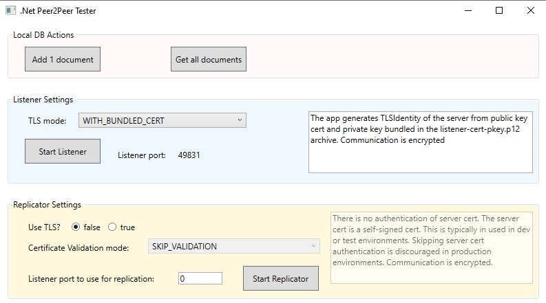
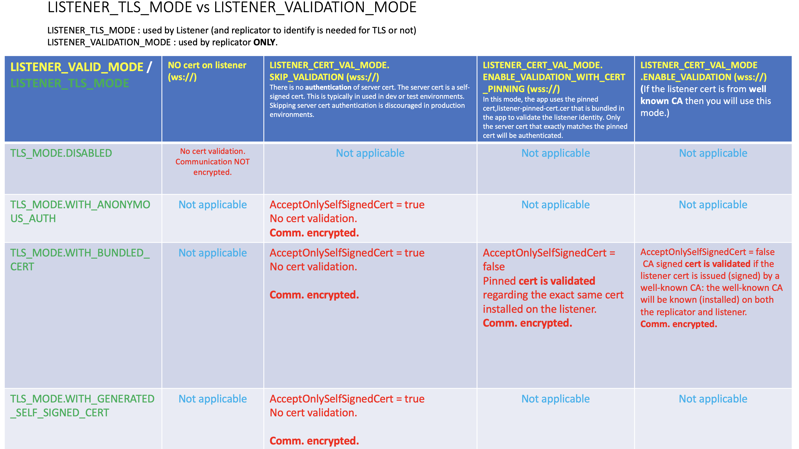

# Peer2peer_basic_sample
A single .Net app containing both listener (passive peer) and replicator (active peer)

## What's inside?
This app can be run on 2 separate Windows (10) machines:
- the listener is executed on the first machine(passive peer)
- while the second machine executes the replicator part (active peer)

Different TLS combinations (with/without certificate validation) can be tested.

Code freely inspired from: 
 - https://github.com/couchbaselabs/couchbase-lite-peer-to-peer-sync-examples
 - https://github.com/couchbaselabs/couchbase-lite-peer-to-peer-sync-examples/tree/master/dotnet/P2PListSync/P2PListSync
 
## Other useful links
https://docs.couchbase.com/couchbase-lite/current/android/p2psync-websocket.html

## Matrix for Listener validation mode (at replicator level) according to the deinfed Listener TLS mode

